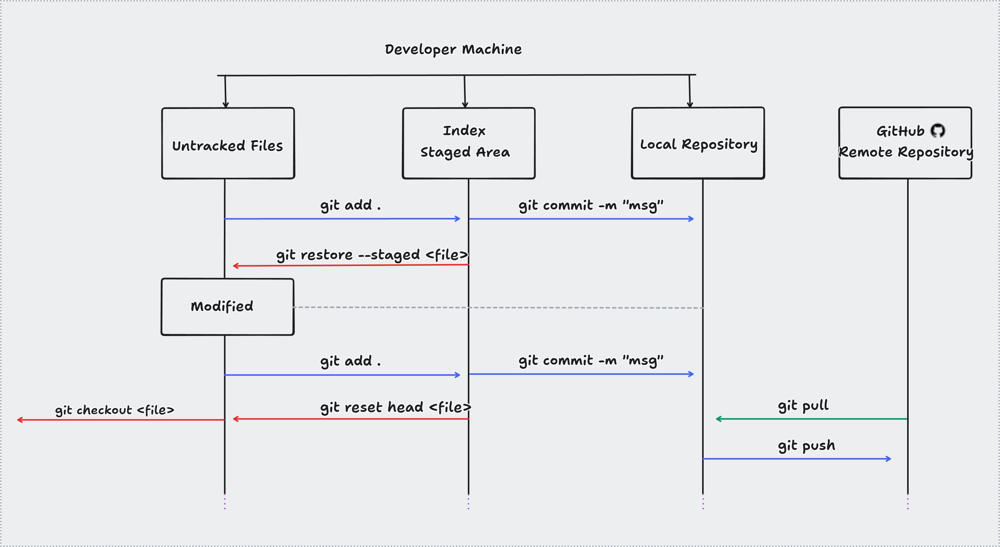

<div align="center">

  
  <h1 align="center" style="color:red"><strong>Git Cheat Sheet</strong></h1>

</div>
<div align="center">
    <p>| <a href="https://git-scm.com/doc"> Git Documentation</a> |</p>                    
</div>


#### Areas de trabalho do git (ilustração)
	- 'untracked files': porta de entrada de novos recursos.
	- 'stage area': arquivos adicionados(add) para compor o commit.
	- 'local repository': contem commits enviados e recebidos do repositório remoto.   


- reset, fetch, merge, stash, revert  

- properties: HEAD, HEAD~1, HEAD~2, --soft, --hard 
 		  

#### Comandos:

*Iniciar git no projeto*

```
	git init
``` 


*Ajuda com detalhes do comando*

```
	git help <comando>
``` 


*Mostrar conteúdo da 'untracked' e da 'stage' areas*

```
	git status
``` 


*Adicionar atualizações para a 'stage' area*

```
	git add .

	git add <nome-do-arquivo>
``` 


*Commitar contribuições*

```
	git commit -m "<descrição>"

	git commit -am "<descrição>"
``` 


*Mostrar 'commits' no repositório local*

```
	git log

	git log --stat

	git log --graph

	git log --oneline

	git log --decorate

	git log --author="<autor-name>"
``` 


*Mostra modificações nos arquivos*

```
	git show

	git show <hash-code>

	git shortlog -sn
``` 


*Mostrar diferenças entre modificações 'untracked', 'staged' ou remota*

```
	git diff
	
	git diff HEAD

	git diff --name-only

	git diff main origin/main
``` 


*Trabalhar com branchs*

```
	git branch

	git branch -r 

	git checkout -b <nome-do-novo-branch>

	git checkout <acessar-um-branch-pelo-nome>

	git branch -d <nome-do-branch-para-deletar>

	git branch -D <nome-do-branch-para-deletar-forçado>
``` 


*Endereço remoto geralmente origin*

```
	git remote -v
	
	git remote add <nome-do-apontamento> <url-do-apontamento-remoto>

	git remote rm <remove-apontamento-pelo-nome>
```


*Clonar repositório remoto*

```
	git clone
	
	git clone <git@github.com:Nome-do-Usuario/repositorio.git> <nome-para-novo-diretorio-local>
``` 


*Atualizar repositório local com alterações do repositório remoto*

```
	git pull

	git pull <remote-origin> <branch-remoto>
``` 


*Enviar commits do repositório local para repositório remoto*

```
	git push

	git push <remote-origin> <branch-remoto>

	git push <nome-da-tag>

	git push --tags
``` 

	

	git stash (apply, list, show, drop, clear, create, store)
	git config --global alias.s status 
	
--- Desfazendo Coisas no Git 

	git checkout "Nome_Arquivo" (retira modifica��o do arquivo ainda na �rea de trabalho(unstaged file))
	git reset HEAD (retira o arquivo do stage-area, para depois usar o comando git checkout e retirar as altera��es indesej�veis) 
	git reset "HashCode"(--soft, --mixed, --hard) retira commits
	git revert "Hash-Code" (hash do commit a ser removido)
	
-- Tag
	git tag (mostra tags geradas)
	git tag -a 1.0.1 -m "Mensagem link" (cria tag)
	git push origin master --tags

--- GitHub - Fork
	Fazer um fork(no GitHub) de projetos de outros dom�nios, traz uma c�pia do projeto para meu reposit�rio remoto. 

--- .gitignore 
   
	- criar um arquivo .gitignore
	
	O .gitignore � um arquivo de texto, onde anotamos o que deve ser ignorado pelo git. 
	- *.json (*.extensao-do-arquivo): ignora todos os arquivos com tal extens�o

	- nome_do_arquivo : ignora o arquivo especificado
	- um reposit�rio, no https://github.com/github/gitignore, especifica padr�es para desenvolvimento em varias plataformas(java, etc...) 

----- Apagando Tags e Branchs em Reposit�rios Remotos

	git tag -d cod-tag (ex. 1.0.1 - s� apaga local)
	git push origin :1.0.0 (apaga tag remota)
	git push origin :master (apaga branch remoto)


----- Observa��es Gerais:

- falando de diff: "sempre use o git diff antes de fazer um commit".
- git reset: "usa-se a HashCode anterior ao commit que se quer retirar"
- revert: "ele retira as altera��es, informa na log o revert e n�o apaga o commit de origem do problema da log - o revert serve pra resetar o arquivo sem perder as altera��es que foram feitas"


